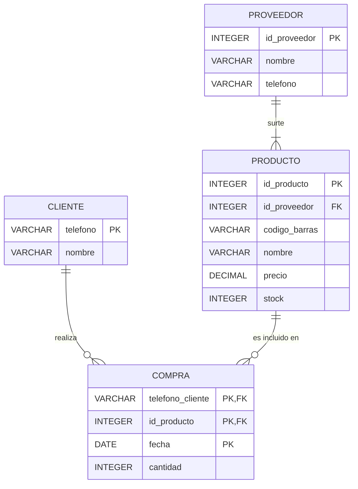

# 🏢 Primer Avance: Requisitos y Modelo Conceptual

Aquí se documenta la recolección de requisitos obtenida de la tienda y el diseño inicial de la base de datos, siguiendo la estructura formal del proyecto.

## 1) Narración del cliente (requisitos en lenguaje natural)
"Soy el dueño de la tienda de novedades y plásticos 'Mr. 5'. Tenemos varias sucursales y necesitamos un sistema para gestionar nuestra mercadería, proveedores y las ventas diarias. Aunque nuestros productos sí traen código de barras de fábrica, actualmente anotamos el inventario a mano, lo que hace que controlar el stock y los precios sea un caos. Un proveedor nos surte varios productos, y registramos cada producto con un proveedor principal para saber a quién reclamarle cuando falta mercadería. Las ventas aquí son rápidas y al contado; una regla estricta es que **no se fía a nadie**. Como somos un comercio informal de paso, casi todos compran de forma anónima, pero sí necesitamos anotar el Nombre y Teléfono de nuestros clientes más frecuentes para avisarles cuando nos llega mercadería nueva o resolver dudas de sus compras (qué se llevaron, cantidad y fecha)."

## 2) Suposiciones (decisiones para aclarar ambigüedades)
* Como el negocio es informal, a los clientes frecuentes los identificaremos únicamente por su número de teléfono celular (`telefono`), el cual funcionará como su identificador único.
* Aunque la mayoría de productos tienen código de barras, el sistema generará un `id_producto` numérico interno. Esto es porque a veces llegan artículos plásticos sueltos sin etiqueta. El código de barras original se guardará como un dato opcional.
* Se asume estrictamente que no existe el crédito o "fiado"; toda compra registrada se considera pagada al contado en el momento.
* Una compra incluye varios productos y un producto es comprado por varios clientes (N:M). Esta asociación guarda la cantidad vendida y la fecha.

## 3) Identificación de Entidades, Atributos, Tipos y PK
Usamos notación UML simplificada de tres compartimentos para cada entidad:

┌─────────────┐
│ PROVEEDOR   │
├─────────────┤
│ + id_proveedor: INTEGER PK (AUTOINCREMENT)
│ + nombre: VARCHAR(100) NOT NULL
│ + telefono: VARCHAR(20)
└─────────────┘

┌─────────────┐
│ PRODUCTO    │
├─────────────┤
│ + id_producto: INTEGER PK (AUTOINCREMENT)
│ + id_proveedor: INTEGER FK → PROVEEDOR(id_proveedor) NOT NULL
│ + codigo_barras: VARCHAR(50) UNIQUE
│ + nombre: VARCHAR(100) NOT NULL
│ + precio: DECIMAL(8,2) CHECK (precio > 0) NOT NULL
│ + stock: INTEGER CHECK (stock >= 0) DEFAULT 0
└─────────────┘

┌─────────────┐
│ CLIENTE     │
├─────────────┤
│ + telefono: VARCHAR(15) PK
│ + nombre: VARCHAR(100) NOT NULL
└─────────────┘

┌──────────────────────┐
│ COMPRA (CLIENTE_PROD)│
├──────────────────────┤
│ + telefono_cliente: VARCHAR(15) FK → CLIENTE(telefono) PK parcial
│ + id_producto: INTEGER FK → PRODUCTO(id_producto) PK parcial
│ + fecha: DATE DEFAULT CURRENT_DATE PK parcial
│ + cantidad: INTEGER DEFAULT 1 CHECK (cantidad > 0)
└──────────────────────┘
---

* 🖼️ [Clic aquí para abrir y ver la imagen del Diagrama UML](./diagrama_uml.jpg)

## 4) Relaciones y cardinalidades (con justificación)
* **PROVEEDOR (1) — (N) PRODUCTO**
  *Justificación:* Un proveedor distribuye múltiples productos a la tienda, pero cada producto registrado se asocia a un único proveedor principal para mantener el canal de reclamos ordenado.
* **CLIENTE (N) — (M) PRODUCTO (mediante la tabla asociativa COMPRA)**
  *Justificación:* Un cliente frecuente puede comprar varios productos en una visita. A su vez, un producto del inventario es comprado por muchos clientes. La tabla asociativa almacena la cantidad de artículos llevados y la fecha.

## 5) Reglas de negocio y restricciones importantes
* **Cero crédito (No se fía):** El sistema asume que el 100% de las transacciones son al contado. 
* **Stock no negativo:** El inventario nunca puede ser menor a cero (`CHECK stock >= 0`). 
* **Relación estricta de proveedores:** No se puede ingresar un nuevo producto al catálogo si no se le asocia un proveedor existente (`FK NOT NULL`).

## 6) DER (Diagrama Entidad-Relación) — Notación Sirena

A continuación se presenta el modelo conceptual generado automáticamente, además del archivo original adjunto:

---

## 📎 Anexo: Modelo Conceptual Original

Aquí puedes ver y descargar el diagrama original elaborado en Draw.io con todos los detalles visuales de las entidades y relaciones:

[📥 Clic aquí para ver el diagrama (Draw.io / PDF)](./Diagrama.drawio.pdf)
